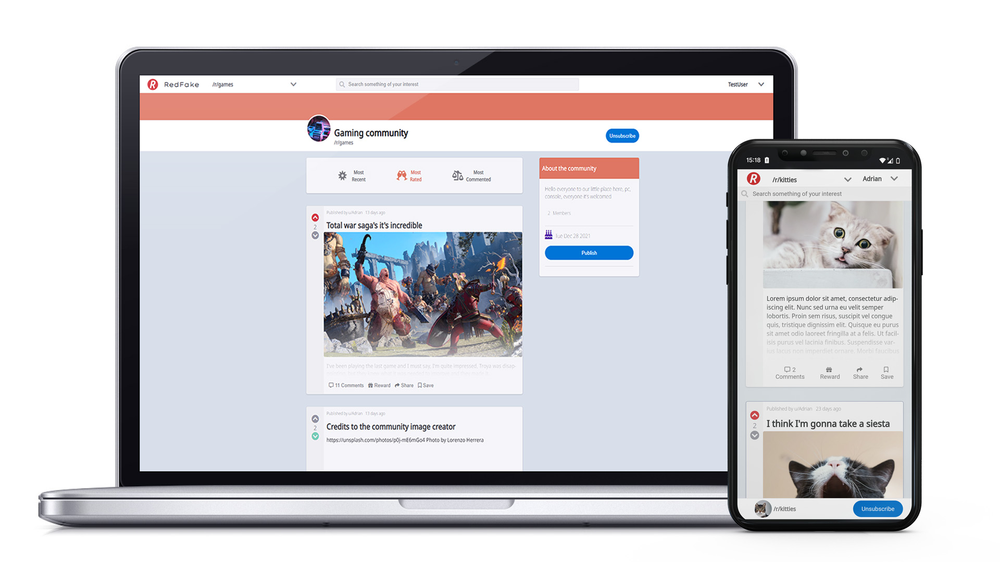

# Reddit Clone

You can test the app by clicking the following link -> <a href="https://reddit-clone-59235.web.app//">Live Preview</a>

## Technologies

  <table>
<tr>
    <td align="center"height="108px" width="108px">
      
       <strong>JavaScript</strong>
    </td>
    <td align="center"height="108px" width="108px">
      
       <strong>React</strong>
    </td>
        <td align="center" height="108px" width="108px">
      
       <strong>HTML5</strong>
    </td>
        <td align="center"height="108px" width="108px">
      
       <strong>CSS3</strong>
    </td>
         <td align="center"height="108px" width="108px">
      
       <strong>Emotion/Styled</strong>
    </td>
        <td align="center" height="108" width="108">
      
       <strong>Firebase</strong>
    </td>
</tr>
</table>

## Features

The following features are present in the app:

-Community creation. 
-Create posts. 
-Search bar. 
-Comment to posts. 
-Replies to comments. 
-Vote system. 
-Subscription to communities, if you are subscribed, you will see it in the dropdown while login. 
-Filter by most recent, rated, or commented posts 
